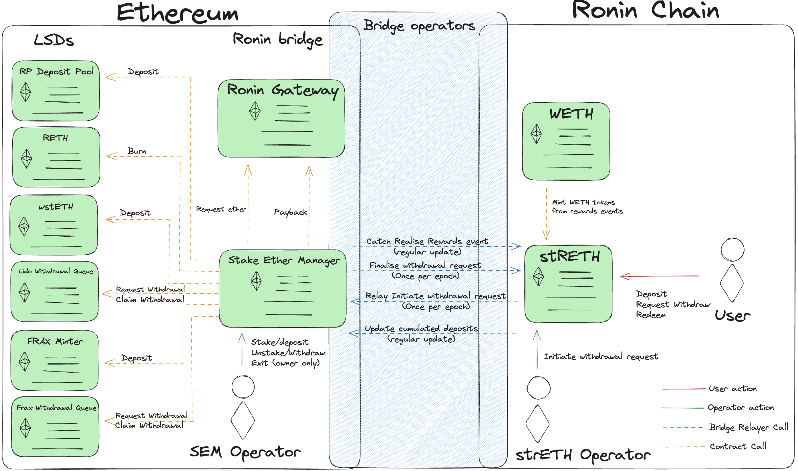

# REP-0009: Add Ether staking capability to the Ronin bridge on mainnet

## Preamble

<pre>
REP-0009
Title: Add Ether staking capability to the Ronin bridge on mainnet
Author: Owl Of Moistness (discord: owlofmoistness)
Type: Bridge Track
Status: Draft
Created: 2023-12-06
</pre>

## Abstract

REP-0009 describes the process of enabling staking capability with ether that is residing on the Ronin mainnet bridge via deposits into LSDs (Liquid Staking Derivates).
This will allow users that opt into this scheme to earn eth rewards via the value accrual of those LSDs.

## Rationale

As of today's writting, a little over 34,161 ether is seating on the Ronin Bridge V2 contract. With an average of 4% apy for staking ether via validation, the ether in the birdge could generate up to around 1,366 ether. Those rewards can be distributed to users as well the AXS treasury and bridge operators.

## Specification

The current proposed system involved the creation of a new ERC-4626 Tokenised vault contract on the Ronin network that will represent the reward accrual of ether on mainnet.

The token representing the vault will be called Staked Ronin Ether (strETH). Over time strETH will increase with value as more ether rewards are realised.

An additional module should be added to the Ronin Bridge V2 contract on mainnet called the Staked Ether Manager (SEM) that will be responsible for depositing and withdrawing ether to and from different LSDs (Currently eligible projects would be Lido Finance, RocketPool and Frax Finance).

Users shall be able to deposit without any restrictions their WETH to obtain strETH until the deposit limit is reached. This limit can be updated at any given time to be increased or decreased. When WETH is deposited, it increments a `cumulativeWETHStaked` variable that will be sent to mainnet to indicate how much ether can be used for staking. User shall be able to redeem their strETH back into WETH every cyclic withdrawal periods (every 7 days + mainnet unwinding time).

A final requirement is necessary in the form of task required to be performed by Bridge operators. The operators will need to provide:

- Regular update of the cumulative amount of deposited WETH on the strETH contract from Ronin network  to the SEM module on mainnet.
- Regular update of the the realised ether rewards from holding various LSDs that should trigger WETH minting in the strETH contract on Ronin network.
- Cyclic update of the required Ether to be withdrawn every Withdrawal period from the strETH contract on Ronin network to the SEM module on mainnet
- Cyclic update of the finalisation of the Withdrawal period from the SEM module on mainnet to the strETH contrain on Ronin network

Operators will need to reach quorum to transfer information inbetween Ronin Network and Ethereum Mainnet, acting as oracles.

A withdrawal cycle will occur like this:
1. During 7 days, users will be able to request their strETH to be redeemed. This action will lock their tokens into the contract and cannot be undone.
2. After the 7 days, the withdrawal request is initiated on Ronin network and an event is emitted providing the necessary ether to be withdrawn on mainnet. This information will be relayed by the bridge operators
3. After receiving the Withdrawal Initiation event from ronin, the SEM will start the process of unwinding enough LSDs to obtain the required ether amount to be withdrawn. This may be instant or may take a few days to wait on the various withdrawal queues of the LSD protocols.
4. Once enough ether has been withdrawn, the SEM will relay a message that the withdrawal cycle has been finalised via an event. This information will be relayed by the bridge operators.
5. On reception of the withdrawal finalisation, the strETH contract locks the final `pricePerShare` for this withdrawal cycle, allowing all users that have requested a withdrawal to burn their strETH and redeem WETH. A new withdrawal cycle will now commence.

## Reference

ERC-4626 Tokenized Vault Standard: <https://ethereum.org/en/developers/docs/standards/tokens/erc-4626/> 

RocketPool Protocol: <https://docs.rocketpool.net/>

Lido Finance Protocol: <https://docs.lido.fi/>

Frax Finance Protocol: <https://docs.frax.finance/>

## Security analysis

There are 3 main risks that need to be handled correctly to keep this system as secure as possible.
1. **Bridge Upgrade**: We want to leave the  ronin bridge as unchanged as possible. To do this, the SEM module should not be deployed as an inheritance but as a standalone, immutable contract. The only required change on the bridge would be a function to enable the SEM to request for ether unconditionally. Only the SEM contract address should be able to call this function successfully.
2. **Ether flow on the SEM**: The ether received on the SEM can only go in 2 different places. Either deposited into LSDs or back into the bridge. SEM operators won't be able to do anything else. At worse SEM operators can only decide to do nothing, which means ether remain on the bridge if not queried to be deposited into LSDs or if during a withdrawal request, the procedure may take longer until an honest operator or Sky Mavis itself executes the necessary measures to withdraw ether from the LSDs.
3. **Bridge operator honesty**: This problem is in itself a core problem of the bridge initially. If malicious bridge operators decided to send wrong information back and forth between mainnet and ronin, the bridge wouldn't operate. Nevertheless, measure can be taken to make sure that any information relayed by BOs from on chain to the other is within expected values. For example, the `cumulativeWETHStaked` variable relayed from Ronin to mainnet can only be higher than the previously logged value. 

## Economic analysis

Assuming all ether is staked at 4% apy, those 1366 ether can be split into 3 baskets of various weights:

- 80% of rewards will go back to strETH holders
- 15% of rewards will be sent to the AXS treasury to be used within the Ronin Ecosystem
- 5% will be used as motivation for SEM and bridge operators

Rewarding these 3 type of users should allow for strETH to become a widely adopted token on the ronin network to be implemented in various products like Katana DEX, form of payment in the mavis marketplace and more as the ecosystem matures.

Treasury share makes a lot of sense given the acceleration of the ronin ecosystem is onboarding more and more projects within their chain. Giving such projects grants in forms of strETH or giving it away under the condition of active gameplay which is Sky Mavis' vision will enable economical incentives to capture more players.

Finally this new system requires extra care from operators to make it run smoothly, rewarding them should also be part of the plan to ensure a stable service as it grows and matures.
Further expansions of this model can be done with USDC who can be deposited in Maker to generate dai and deposit it in the DSR to generate ~5%.

## License

The content is licensed under [CC0](https://creativecommons.org/publicdomain/zero/1.0/).